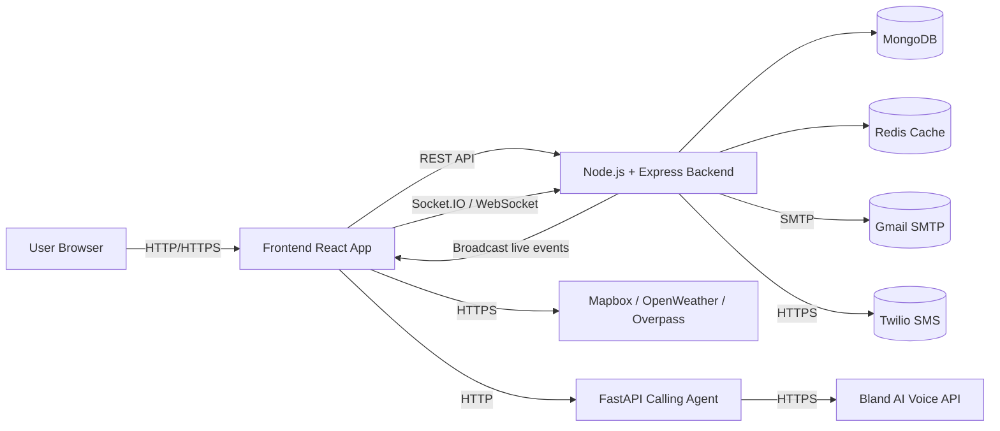
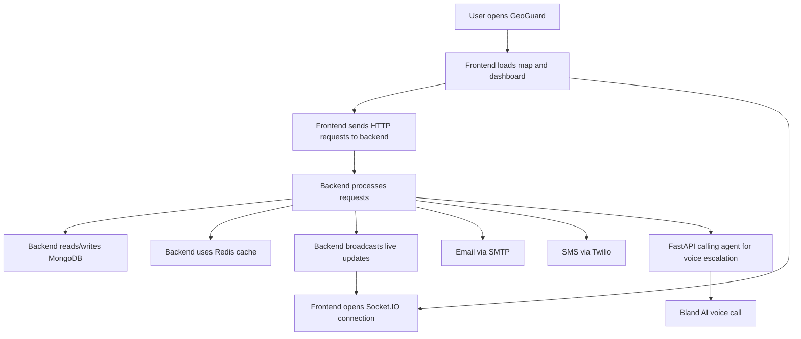
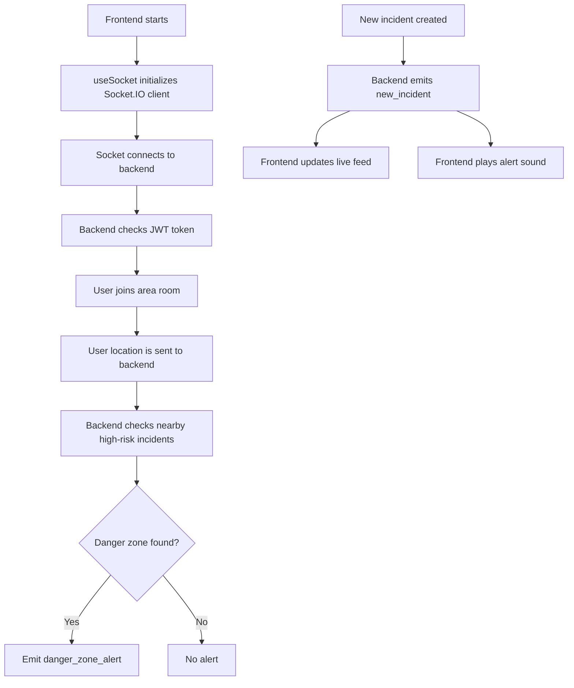
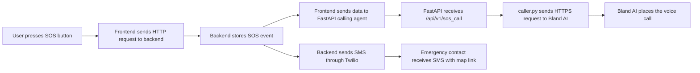

# GeoGuard Network Architecture

## 1. Project Summary

GeoGuard is a real-time safety intelligence platform. From a computer networks point of view, it is a distributed application that uses multiple protocols and networked services to move data between the browser, backend, external APIs, and emergency services.

The main goals of the system are:

- Show live safety incidents on a map
- Push new alerts to users immediately
- Send emergency SMS and voice-call escalation
- Authenticate users securely
- Cache frequently used data for speed
- Use third-party APIs for maps, weather, news, and AI call routing

This document explains where each network concept appears in the project and how it helps the overall design.

---

## 2. High-Level Architecture

GeoGuard follows a client-server architecture with one main backend and one extra SOS microservice.

### Main files involved

- [backend/server.js](backend/server.js)
- [backend/src/app.js](backend/src/app.js)
- [backend/src/sockets/index.js](backend/src/sockets/index.js)
- [backend/src/services/email.service.js](backend/src/services/email.service.js)
- [backend/src/send_sms/sms.js](backend/src/send_sms/sms.js)
- [backend/src/config/redis.js](backend/src/config/redis.js)
- [frontend/src/services/api.js](frontend/src/services/api.js)
- [frontend/src/services/socket.js](frontend/src/services/socket.js)
- [frontend/src/hooks/useSocket.js](frontend/src/hooks/useSocket.js)
- [calling_agent/main.py](calling_agent/main.py)
- [calling_agent/caller.py](calling_agent/caller.py)

---

## 3. Overall Data Flow

This flow shows that the app is not only a UI. It is a connected network system that combines request-response communication, realtime push communication, and external service integration.

---

## 4. Protocols Used in the Project

### 4.1 HTTP

HTTP is used for standard request-response communication.

#### Where it appears

- Frontend API client in [frontend/src/services/api.js](frontend/src/services/api.js)
- Express routes in [backend/src/app.js](backend/src/app.js)
- FastAPI route in [calling_agent/main.py](calling_agent/main.py)

#### What it does

- Login and registration
- Fetching incidents and analytics
- Updating user profile and location
- Uploading media
- Triggering SOS operations
- Talking to the calling agent service

#### Why it matters

HTTP is the basic protocol for browser-to-server communication. In GeoGuard, it is used whenever the frontend requests data or submits a form.

---

### 4.2 HTTPS

HTTPS is used for secure communication with external APIs and services.

#### Where it appears

- Bland AI calls in [calling_agent/caller.py](calling_agent/caller.py)
- OpenWeather API in [backend/src/services/dataFusion.service.js](backend/src/services/dataFusion.service.js)
- Mapbox and Overpass requests in frontend map and routing features

#### Why it matters

HTTPS protects the data while it travels across the network. This is important because GeoGuard sends sensitive information such as:

- User identity data
- Location coordinates
- Emergency contact details
- Authentication tokens

#### Networking concept demonstrated

- Secure transport
- TLS encryption
- Protection against interception and tampering

---

### 4.3 WebSocket / Socket.IO

WebSocket is the most important realtime protocol used in the project. Socket.IO provides the client and server implementation, plus fallback support.

#### Where it appears

- Socket.IO server setup in [backend/server.js](backend/server.js)
- Socket event handling in [backend/src/sockets/index.js](backend/src/sockets/index.js)
- Socket client in [frontend/src/services/socket.js](frontend/src/services/socket.js)
- Socket hook wiring in [frontend/src/hooks/useSocket.js](frontend/src/hooks/useSocket.js)

#### What it does

- Sends new incident updates instantly
- Sends SOS alerts instantly
- Updates user count in real time
- Sends danger-zone alerts based on location
- Lets users join geographic rooms
- Supports live mode tracking

#### Why it matters

This avoids polling the backend again and again. Instead, the server pushes updates immediately, which is much better for an emergency safety system.

#### Network concept demonstrated

- Persistent connection
- Low-latency communication
- Bidirectional messaging
- Event-driven architecture

---

### 4.4 Socket.IO Transport Fallback

The app configures both `websocket` and `polling` as transports.

#### Where it appears

- [backend/server.js](backend/server.js)
- [frontend/src/services/socket.js](frontend/src/services/socket.js)

#### Why it matters

If direct WebSocket is not available, Socket.IO can fall back to HTTP polling. This makes the project more robust in unstable network conditions.

#### Network concept demonstrated

- Transport negotiation
- Reliability
- Compatibility across different network environments

---

### 4.5 SMTP

SMTP is used to send emails.

#### Where it appears

- Mail transporter setup in [backend/src/services/email.service.js](backend/src/services/email.service.js)
- Welcome email flow in the same file
- Login email flow in the same file

#### What it does

- Sends a welcome email when a user registers
- Sends a login notification email when a user logs in

#### Why it matters

Email works as a secondary notification channel. It is useful for confirmation, trust, and security awareness.

#### Network concept demonstrated

- Application-layer email transfer
- Mail server communication
- SMTP host, port, and authentication

---

### 4.6 SMS Gateway

Twilio is used to send emergency SMS alerts.

#### Where it appears

- SMS sender in [backend/src/send_sms/sms.js](backend/src/send_sms/sms.js)
- SOS trigger in [backend/src/controllers/userController.js](backend/src/controllers/userController.js)

#### What it does

- Sends emergency location messages to contacts
- Includes a Google Maps link for quick access

#### Why it matters

SMS is important because it reaches people even if they are not inside the app. This makes the SOS system more reliable.

#### Network concept demonstrated

- External messaging gateway
- Out-of-band alert delivery
- Mobile network communication

---

### 4.7 Redis

Redis is used as a networked in-memory cache.

#### Where it appears

- Redis client setup in [backend/src/config/redis.js](backend/src/config/redis.js)
- Cache helper methods in the same file
- Used by controllers such as user and incident handlers

#### What it does

- Caches repeated data
- Reduces database load
- Improves response speed
- Keeps working even if Redis is unavailable

#### Why it matters

GeoGuard deals with realtime data. Redis helps the backend respond faster when many users are active at the same time.

#### Network concept demonstrated

- Client-server caching
- Reconnect strategy
- Temporary distributed state

---

### 4.8 FastAPI Calling Agent

The calling agent is a separate Python microservice.

#### Where it appears

- FastAPI app in [calling_agent/main.py](calling_agent/main.py)
- Voice-call logic in [calling_agent/caller.py](calling_agent/caller.py)

#### What it does

- Receives SOS request data
- Validates the request
- Sends the emergency message to Bland AI
- Initiates a voice call to the first emergency contact

#### Why it matters

This separates the SOS voice escalation logic from the main backend. That is a good example of microservice-based network design.

#### Network concept demonstrated

- Service-to-service HTTP communication
- Cross-language integration
- Separate port-based service deployment

---

### 4.9 JWT Authentication Over Network Requests

JWT is used to secure HTTP and socket communication.

#### Where it appears

- Authentication routes in the backend
- Socket auth middleware in [backend/src/sockets/index.js](backend/src/sockets/index.js)

#### What it does

- Authenticates API requests
- Authenticates socket connections
- Links the socket session to the logged-in user

#### Why it matters

It keeps the communication secure and ensures that private actions are tied to the right user.

#### Network concept demonstrated

- Token-based security
- Stateless authentication
- Identity propagation across layers

---

## 5. Realtime Flow Diagram

### Why this flow is useful

It shows how the app keeps users informed instantly. This is the strongest example of networking depth in the project.

---

## 6. SOS Escalation Flow

### Why this flow is useful

This is the best diagram for viva because it shows an end-to-end emergency pipeline using multiple protocols.

---

## 7. Where Each Protocol Helps the Project

| Protocol | Where Used | Benefit |
|---|---|---|
| HTTP | frontend to backend, frontend to FastAPI | Standard API communication |
| HTTPS | external APIs, voice-call provider | Secure data transfer |
| WebSocket | live incident feed, alerts, user count | Real-time updates |
| SMTP | registration and login emails | Email notifications |
| SMS | SOS emergency contacts | Out-of-app alerting |
| Redis | cache and temporary state | Better performance |
| JWT | API and socket auth | Secure user sessions |

---

## 8. Detailed File-to-Concept Mapping

### Backend

- [backend/server.js](backend/server.js): Creates the HTTP server and attaches Socket.IO
- [backend/src/app.js](backend/src/app.js): Configures Express, CORS, and API routing
- [backend/src/sockets/index.js](backend/src/sockets/index.js): Handles socket auth, rooms, live updates, and danger alerts
- [backend/src/services/email.service.js](backend/src/services/email.service.js): Sends SMTP emails
- [backend/src/send_sms/sms.js](backend/src/send_sms/sms.js): Sends Twilio SMS alerts
- [backend/src/config/redis.js](backend/src/config/redis.js): Manages Redis caching and reconnect logic
- [backend/src/services/dataFusion.service.js](backend/src/services/dataFusion.service.js): Calls external weather APIs over HTTPS

### Frontend

- [frontend/src/services/api.js](frontend/src/services/api.js): Main HTTP client
- [frontend/src/services/socket.js](frontend/src/services/socket.js): Socket.IO client and event handlers
- [frontend/src/hooks/useSocket.js](frontend/src/hooks/useSocket.js): Connects UI state to realtime events

### Calling Agent

- [calling_agent/main.py](calling_agent/main.py): FastAPI service entry point
- [calling_agent/caller.py](calling_agent/caller.py): Sends HTTPS requests to Bland AI

---

## 9. Why This Project Is Strong for a Computer Networks Course

GeoGuard is a strong networking project because it combines multiple real-world network communication methods in one system.

### It demonstrates

- Client-server communication
- Realtime push communication
- Secure third-party API communication
- Emergency alert distribution
- Microservice coordination
- Cache-backed backend design
- Authenticated sessions across HTTP and sockets

### Good points for presentation

- It is a practical and original use case
- It uses networking to solve a real safety problem
- It combines multiple protocols instead of relying on only one
- It shows modern distributed system design

---

## 10. Short Viva Answer

GeoGuard is a distributed safety platform that uses HTTP for normal API communication, WebSocket for realtime alerts, SMTP for email notifications, Twilio SMS for emergency messaging, Redis for fast caching, and a FastAPI microservice for voice-call escalation. It shows how different network protocols are used together in a real system to provide secure, fast, and reliable communication.

---

## 11. Suggested Presentation Order With What to Explain

Use this sequence if you want to present the project clearly in class.

### 1. Start with the project idea

What to explain:

- GeoGuard is a real-time safety intelligence platform.
- It helps users see nearby incidents, receive alerts, and respond quickly in emergencies.
- The project is not only a UI project; it is a distributed networked system.

Why this matters:

- It sets the context for why networking is important in the project.
- It helps the audience understand the real-world use case first.

### 2. Show the architecture diagram

What to explain:

- The browser talks to the backend through HTTP and Socket.IO.
- The backend talks to MongoDB, Redis, SMTP, Twilio, and the calling agent.
- The calling agent talks to Bland AI.

Why this matters:

- It shows the whole system at a glance.
- It makes the distributed nature of the project easy to understand.

### 3. Explain HTTP and HTTPS

What to explain:

- HTTP is used for normal request-response communication.
- HTTPS is used for secure third-party communication.
- The frontend uses HTTP to talk to the backend.
- External APIs like OpenWeather and Bland AI use HTTPS.

Why this matters:

- It shows how browser-based apps communicate with servers.
- It demonstrates secure data transfer for sensitive information.

### 4. Explain WebSocket and realtime updates

What to explain:

- Socket.IO creates a persistent connection between client and server.
- The backend pushes new incidents, SOS alerts, and danger-zone alerts immediately.
- The frontend listens for those events and updates the UI without reloading.

Why this matters:

- This is the most important realtime networking feature in the project.
- It shows how an event-driven system works.

### 5. Explain SMTP and SMS for alerts

What to explain:

- SMTP is used to send welcome and login emails.
- Twilio SMS is used for emergency contact notification.
- These two channels work as extra alert layers outside the app.

Why this matters:

- It shows multi-channel communication.
- It is useful in emergencies because the message reaches the user even if they are not on the app.

### 6. Explain Redis and FastAPI microservice

What to explain:

- Redis is a fast cache used by the backend.
- It reduces database load and helps speed up repeated reads.
- The FastAPI calling agent is a separate microservice running on its own port.
- The frontend sends SOS data to it, and it then calls Bland AI.

Why this matters:

- Redis shows performance optimization in a networked system.
- FastAPI shows microservice-based architecture and service-to-service communication.

### 7. End with the SOS flow diagram

What to explain:

- The SOS flow combines HTTP, SMS, HTTPS, and a microservice.
- The frontend sends the SOS request.
- The backend sends SMS.
- The calling agent places the emergency voice call.

Why this matters:

- It is the best end-to-end example of the project’s networking design.
- It leaves a strong impression in viva or presentation.

---

## 12. TCP/IP Usage in GeoGuard

TCP/IP is the base networking model underneath most communication in this project. Even when the code does not manually create TCP packets, the application still depends on TCP/IP through the protocols and services it uses.

### Direct use of TCP/IP-related communication

- HTTP requests from the frontend to the backend use TCP under the hood.
- HTTPS requests to external APIs also use TCP plus TLS encryption.
- Socket.IO WebSocket connections run over TCP after the initial handshake.
- SMTP email delivery uses TCP to communicate with mail servers.
- Redis communicates over a TCP socket to the Redis server.
- FastAPI and the Node backend communicate over HTTP, which runs on TCP.

### Indirect use of TCP/IP-related communication

- Twilio SMS delivery happens through network APIs that rely on IP-based communication.
- Bland AI voice escalation is triggered through HTTPS APIs that rely on TCP/IP.
- Mapbox, OpenWeather, and Overpass requests all depend on IP routing, TCP transport, and DNS resolution.

### How to explain TCP/IP in the presentation

You can say:

"GeoGuard uses the TCP/IP model at the transport and network layers indirectly through HTTP, HTTPS, WebSocket, SMTP, Redis, and third-party APIs. The application does not manually handle packets, but every network call it makes is ultimately carried over TCP/IP."

### Why TCP/IP matters here

- It is the underlying foundation for all online communication in the project.
- It connects the browser, backend, databases, cache, email server, SMS gateway, and external APIs.
- It explains how a distributed application can work reliably across different machines and services.
